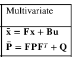
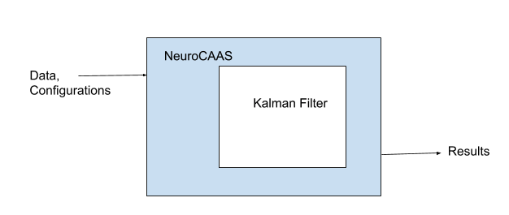

# Welcome to  kalmanfilter's documentation!
==========================================

## What is Kalman Filter?

Kalman Filter, also known as Hidden Markov Model, is a dimensionality reduction model which assumes that data follows an underlying latent linear dynamical system. It projects high dimensional data into a low dimensional represenation while preserving the main features/variables (better known as explanatory variables) which it believes explains the data well.

This project is integrated with an open source platform for neural data analysis called NeuroCAAS. We aim to separate the engineer from the scientist. Hence the only thing users will have to implement are the common paramters for kalman filter such as:

 - Data collected (observations) 
 - Transition matrix: A
 - Noise Covariance: P
 - Input control: B
 - Control Input Noise Covar : U
 - Sensor Measurement: H
 - Sensor Noise Covar: R

The multivariate Kalman Filter follows a multivariate Gaussian distribution. A multivariate Gaussian distribution is defined by the mean and covariance matrices.

There are 2 main procedures for the Kalman Filter:
(1) Updating the empirical results
(2) Predicting the next value

Using the observations we can define our update equations as follow: 

Then the predict step goes as follow: !(Prediction Equations)(predict.png)


The input will be in the form of two files. A .csv  file for the observations and a .yaml file for configurations. This can be uploaded on the website in a drag and drop fashion.




The algorithm handles everything for you. The data is smoothed and compressed to a lower dimension. This illustrations displays the smoothing from the red raw observations to the smoothed green curve (top graph). The bottom graph shows the decrease in variance in approximations as the number of iterations increases.


```eval_rst
.. toctree::
    :maxdepth: 2
    :caption: Contents:

    modules

.. note::
    The documentation for kalmanfilter cotinuously being updated.
```

